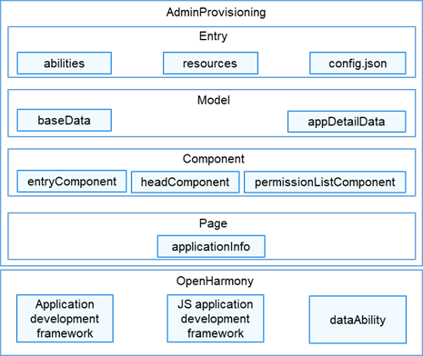

# AdminProvisioning<a name="ZH-CN_TOPIC_0000001103330836"></a>

-   [简介](#section11660541593)
    -   [架构图](#section125101832114213)
-   [目录](#section161941989596)
-   [使用说明](#section123459000)
-   [相关仓](#section1371113476307)

## 简介<a name="section11660541593"></a>

AdminProvisioning应用是OpenHarmony中预置的系统应用，用于企业环境下在设备上发放MDM业务，同时提供了业务发放接口给其它子系统或者三方MDM客户端应用调用，支持在产品上构建完整的MDM解决方案。

### 架构图<a name="section125101832114213"></a>



## 目录<a name="section161941989596"></a>

```
/applications/standard/admin_provisioning
├── build.gradle                                          # 全局编译配置文件
├── settings.gradle                                       # 编译模块配置文件
├── LICENSE                                               # 许可文件
├── entry                                                 # entry模块目录
│   └── src
│       ├── main
│           ├── ets                                       # ets模块目录
│               ├── MainAbility
│                   ├── model                             # 数据管理存放目录
│                   │   ├── appMagagementImpl
│                   │       ├── appDetailData             # 数据管理目录
│                   │   ├── baseData                      # 常量存放目录
│                   ├── pages                             # 组件页面存放目录
│                   │   ├── component
│                   │       ├── entryComponent            # 待激活应用详情组件
│                   │       ├── headComponent             # 本身应用名称组件
│                   │       ├── permissionListComponent   # 待激活应用权限组件
│                   │   ├── applicationInfo
│                   ├── app.ets                           # 全局ets逻辑和应用生命周期管理文件
│           ├── resources                                 # 资源配置文件存放目录
│               ├── base                                  # 默认语言场景，图片资源，字体大小，颜色资源内容存放目录
│               ├── en_AS.element                         # 英文语言场景资源内容存放目录
│               ├── rawfile                               # 本地配置文件存放目录
│               ├── zh_CN.element                         # 中文语言场景资源内容存放目录
│           └── config.json                               # 全局配置文件
├── signature                                             # 证书文件目录
```
## 使用说明<a name="section123459000"></a>

   参见使用说明（[使用说明](./doc/Instructions.md)）

## 相关仓<a name="section1371113476307"></a>

系统应用

**applications\_admin_provisioning**

