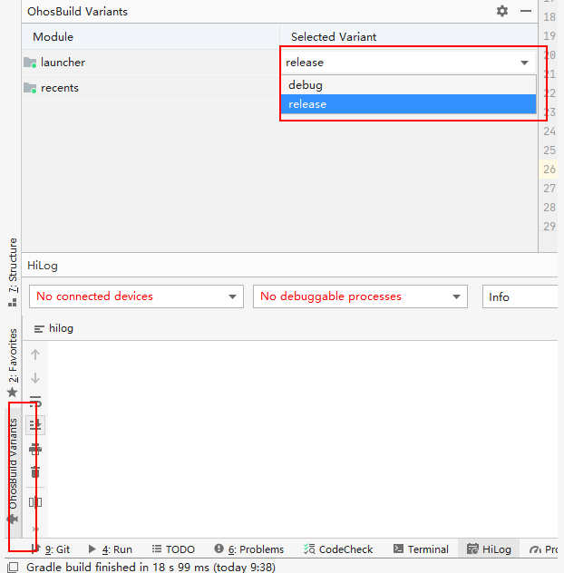
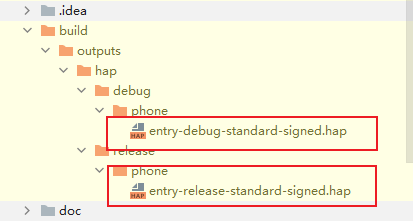

# AdminProvisioning 使用说明
## 代码使用
### 代码下载
#### 配置码云ssh  
1. 打开本地git bash窗口。
2. 进入到.ssh 目录：cd ~/.ssh。 
3. 找到id_rsa.pub文件：ls。
4. 查看公钥：cat id_rsa.pub。
5. 在码云个人设置-安全设置-ssh公钥中配置公钥。
   
#### 下载代码
1. 打开码云AdminProvisioning地址（[下载地址](https://gitee.com/openharmony/applications_admin_provisioning)）。
2. 选择克隆/下载 - ssh方式 -复制下载地址。


3. 本机git bash 中执行。
 ```
   git clone '复制的下载地址'
 ``` 

### 环境搭建
打开DevEco Studio链接下载安装，安装步骤及安装说明详见开发者网站。
    
## 基础开发说明
### 系统接口调用
#### NAPI接口集成
1. 导入指定模块。
``` JavaScript
  import bundle from '@ohos.bundle';
```  
2. 调用模块中的相应函数。
``` JavaScript
  bundle.getApplicationInfos().then(data => {
    
  });
```
### 异步回调的使用
1. 在需要回调操作的ets文件中创建回调函数。
```JavaScript
  subscribeCallback(err, data){
    // do something
  },
```
2. 调用应用内部封装的接口，并传入回调函数。
```JavaScript
  Notification.subscribe(mSubscriber, this.subscribeCallback.bind(this));
```
3. 在AsyncCallback返回数据时可以获取到错误信息或目标数据。
```JavaScript
  subscribeCallback(err, data) {
    Log.showInfo(TAG, 'subscribeCallback finished ====================' + JSON.stringify(data));
  }
```
### 如何引用资源文件
在.ets文件中，可直接通过$r()引用资源。
```` JavaScript
  this.title = this.$r('app.string.hello_world');
````

## 典型接口的使用
1. 获取电池状态接口。
``` JavaScript
  import BatteryInfo from '@ohos.batteryInfo'
  // 根据TS的文件描述，获取对应的电池属性

  batterySOC = BatteryInfo.batterySOC; // 电池剩余电量 0~100;
  batteryCharging = BatteryInfo.chargingStatus; // 电池充电状态
```
2. 返回按键。
``` JavaScript
  import input from '@ohos.injectEventHandler'
  // 在触摸开始及结束时分别调用
  onTouchStart(){
    let res = input.injectEventSync({
           isPressed: true,  // 是否为按下
           keyCode: 2, // 对应code
           keyDownDuration: 1 // keydown 时长
       });
  },
  onTouchStop(){
    let res = input.injectEventSync({
              isPressed: false, // 是否为按下
              keyCode: 2, // 对应code
              keyDownDuration: 1 // keydown 时长
    });
  }
```
## 签名打包
### 签名
#### 签名文件的获取
1. 拷贝OpenHarmony标准版 工程的 prebuilts\signcenter 目录到操作目录。
2. 拷贝AdminProvisioning工程的 signature\adminprovisioning.p7b 到该目录下。
#### 签名文件的配置
1. 打开项目工程，选择 File → Project Structure。


2. 选择 Project → Signing Configs，将对应的签名文件配置如下，完成后点击Apply，再点击OK。


3. 配置完成后，对应的build.gradle文件中会出现如下内容。


### 打包
DevEco Studio 支持 debug 与 release 两种打包类型。可以在 OhosBuild Variants 窗口中进行切换。

 

#### debug打包
1. 代码准备完成后，在 OhosBuild Variants 窗口的 Selected Variant 中选择 debug。   
   
   

2. 选择Build → Build Haps(s)/APP(s) → Build Hap(s)。

   

3. 编译完成后，hap包会生成在工程目录下的 `\build\outputs\hap\debug\phone\`路径下（如果没有配置签名，则只会生成未签名的hap包）。

   
#### release打包
1. 代码准备完成后，在 OhosBuild Variants 窗口的 Selected Variant 中选择 release。   
   
    

2. 选择Build → Build Haps(s)/APP(s) → Build Hap(s)。

   

3. 编译完成后，hap包会生成在工程目录下的 `\build\outputs\hap\release\phone\`路径下（配置好签名后，生成的hap包会显示signed）。
   
   
## 安装、运行、调试
### 应用安装
1. 配置 hdc：进入SDK目录中的toolchains文件夹下，获取文件路径。


>  **说明：**
> 若此处的hdc.exe如果版本较老，可能不能正常使用，需要获取新的hdc.exe文件。hdc命令介绍与下载详见：[hdc仓库地址](https://gitee.com/openharmony/developtools_hdc_standard)


2. 并将此路径配置到环境变量中。


3. 重启电脑使环境变量生效。

4. 连接开发板，打开cmd命令窗口，执行hdc list targets，弹出窗口如下。


5. 等待一段时间后，窗口出现如下打印，可回到输入 hdc list targets 的命令窗口继续操作。


6. 再次输入hdc list targets，出现如下结果，说明hdc连接成功。


7. 获取读写权限。

```
  hdc target mount 
```
8. 将签名好的 hap 包放入设备的 `/system/app` 目录下，并修改hap包的权限。

```
  hdc file send 本地路径 /system/app/hap包名称
  例如：hdc file send adminprovisioning.hap /system/app/adminprovisioning.hap
```
>  **说明：**
> 如果设备不存在 `/system/app` 目录，则需要手动创建该目录并修改权限。
> ```
>   hdc shell
>   cd system
>   mkdir app
>   chmod 777 app
> ```
> `/system/app` 目录放置系统应用，例如：Launcher，SystemUI，Settings 等。但hap包需要在该目录下手动设置权限。
> ```
>   chmod 666 hap包名
> ```
> 此目录应用不用手动安装，系统自动拉起。
### 应用运行
AdminProvisioning属于系统应用，在将签名的 hap 包放入 `/system/app` 目录后，重启系统，应用会自动拉起。
```
  hdc shell
  reboot（不可以直接执行hdc reboot，命令是无效的)
```
>  **说明：**
> 如果设备之前安装过系统应用，则需要执行如下两条命令清除设备中存储的应用信息才能够在设备重启的时候将我们装入设备的新 hap 包正常拉起。
> ```
>   hdc  shell rm -rf  /data/misc_de/0/mdds/0/default/bundle_manager_service
>   hdc  shell rm -rf  /data/accounts
> ```
### 应用调试
#### log打印
1. 在程序中添加 log。
```JS
  console.info("adminprovisioning log info");
```
#### log获取及过滤
1. log获取。

    将log输出至文件。  
```
  hdc shell hilog > 输出文件名称
```

    例：在真实环境查看log，将全log输出到当前目录的hilog.log文件中。  
```
  hdc shell hilog > hilog.log
```

2. log过滤。

    在命令行窗口中过滤log。
```
  hilog │ grep 过滤信息
```
   
    例：过滤包含信息 Label 的 hilog。  
```
  hilog │ grep Label
```
## 贡献代码
### Fork 代码仓库
1. 在码云上打开 AdminProvisioning 代码仓库（[仓库地址](https://gitee.com/openharmony/applications_admin_provisioning)）。

2. 点击仓库右上角的 Forked 按钮，在弹出的画面中，选择将仓库 fork 到哪里，点击确认。

3. Fork 成功之后，会在自己的账号下看见 fork 的代码仓库。

### 提交代码
1. 访问我们自己在码云账号上 fork 的代码仓库，点击“克隆/下载”按钮，选择 SSH，点击“复制”按钮。


2. 在本地新建 AdminProvisioning 目录，在 AdminProvisioning 目录中执行如下命令。
   ```
   git clone 步骤1中复制的地址
   ```

3. 修改代码。
   > 将代码引入工程，以及编译工程等相关内容请参见 **代码使用章节** 部分的相关内容。
4. 提交代码到 fork 仓库。  
   > 修改后的代码，首先执行 `git add` 命令，然后执行 `git commit` 命令与 `git push` 命令，将代码 push 到我们自己的 fork 仓中。
   > 关于代码提交的这部分内容涉及 git 的使用，可以参照 [git官网](https://git-scm.com/) 的内容，在此不再赘述。

### 发起 Pull Request (PR)
在将代码提交到 fork 仓之后，我们可以通过发起 Pull Request（PR）的方式来为 OpenHarmony 的相关项目贡献代码。

1. 打开 fork 仓库。选择 `Pull Requests` → `新建 Pull Request`。
   
2. 在 `新建 Pull Request` 画面填入标题与说明，点击 `创建` 按钮。
   
3. 创建 Pull Request 完成。 PR 创建完成后，会有专门的代码审查人员对代码进行评审，评审通过之后会合入相应的代码库。